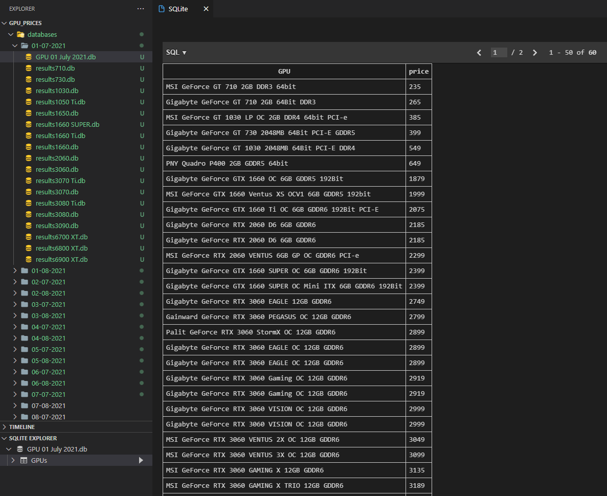

# gpu_price_chart

That's an old project where I planned to build a scraper that scrapes the data about Graphics Card prices from one of my favorite online stores and then saves that data into SQLite 3 databases so that I can use it later to plot some interesting charts using matplotlib. For now the first part has been finished (been scraping the data every day for almost 3 month automatically using Windows Task Scheduler) but charts are yet to be created. That's what I have, for now:

